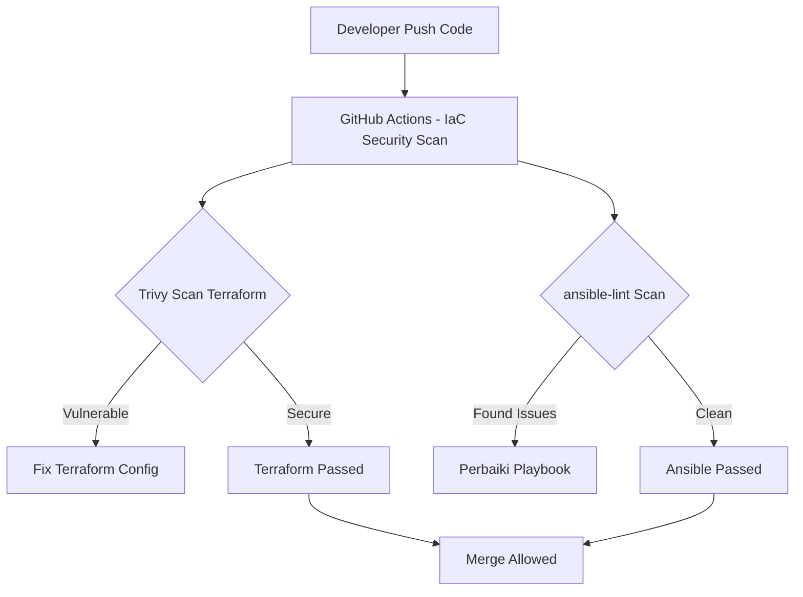

# DevSecOps Week 8

## Infrastructure as Code (IaC) Security

[](https://github.com/kimookoii/devsecops-week8/actions/workflows/iac-security.yml)
[](LICENSE)
[]()

Repository ini berisi praktik DevSecOps Minggu 8 yang berfokus pada keamanan Infrastructure as Code (IaC) menggunakan Terraform, Ansible, Trivy, dan ansible-lint. Seluruh proses disusun agar dapat dijalankan pada Windows tanpa WSL/VM menggunakan Docker dan GitHub Actions sebagai automation pipeline.

---

## 1. Tujuan Pembelajaran

Tujuan utama dari modul ini adalah memahami bagaimana misconfiguration pada IaC dapat dideteksi, diperbaiki, dan diautomasi melalui pipeline DevSecOps, meliputi:

- Penerapan keamanan IaC pada Terraform dan Ansible
- Pendeteksian misconfiguration menggunakan Trivy dan ansible-lint
- Perbaikan konfigurasi yang tidak aman
- Integrasi scanning automatic melalui GitHub Actions CI/CD
- Pembuatan workflow DevSecOps yang terstandarisasi dan maintainable

---

## 2. Struktur Repository

```

devsecops-week8/
├── iac-terraform-sec/
│   ├── main.tf
│   ├── trivy-iac-output.txt
│   ├── trivy-iac-output-secure.txt
│
├── ansible-sec/
│   ├── playbook.yml
│   ├── config.conf
│   ├── lint-results/
│
└── .github/
└── workflows/
└── iac-security.yml

````

---

## 3. Materi: Infrastructure as Code (IaC) Security

Infrastructure as Code memungkinkan infrastruktur didefinisikan dalam bentuk deklaratif. Namun, konfigurasi yang salah (misconfiguration) berpotensi menyebabkan:

- Infrastruktur terbuka atau publik tanpa sengaja
- Konfigurasi keamanan tidak konsisten
- Deployment berisiko dan rawan dieksploitasi

Oleh karena itu dilakukan:

- Scanning IaC secara otomatis (Trivy untuk Terraform, ansible-lint untuk Ansible)
- Validasi konfigurasi
- Perbaikan berdasarkan rekomendasi DevSecOps

---

## 4. Praktik 1 — Terraform IaC Security

### 4.1 Membuat File Terraform Insecure

```hcl
resource "aws_s3_bucket" "example" {
    bucket = "my-insecure-bucket"
    acl = "public-read"
    versioning {
        enabled = false
    }
}
````

### 4.2 Scan dengan Trivy

Perintah:

```powershell
docker run --rm -v "<PATH>/iac-terraform-sec:/scan" \
aquasec/trivy:latest config /scan/main.tf \
--format table --output /scan/trivy-iac-output.txt --timeout 30m
```

### 4.3 Perbaikan Misconfiguration

```hcl
resource "aws_s3_bucket" "example" {
    bucket = "my-insecure-bucket"
    acl = "private"
    versioning {
        enabled = true
    }
}
```

### 4.4 Scan Ulang (Secure)

```powershell
docker run --rm -v "<PATH>/iac-terraform-sec:/scan" \
aquasec/trivy:latest config /scan/main.tf \
--format table --output /scan/trivy-iac-output-secure.txt --timeout 30m
```

---

## 5. Praktik 2 — Ansible IaC Security

### 5.1 Playbook Insecure

```yaml
- hosts: all
  become: yes
  tasks:
    - name: Install Apache
      apt:
        name: apache2
        state: present

    - name: Copy Insecure Config
      copy:
        src: config.conf
        dest: /etc/apache2/config.conf
        mode: 0777
```

### 5.2 Findings ansible-lint

Temuan:

* name[play]: Play tidak memiliki nama
* yaml[truthy]: penggunaan yes tidak valid
* fqcn[action-core]: modul apt dan copy harus menggunakan FQCN
* mode 0777: file permission terlalu permisif
* missing handlers

### 5.3 Perbaikan Playbook

```yaml
- name: Playbook
  hosts: all
  become: true
  tasks:
    - name: Install Apache
      ansible.builtin.apt:
        name: apache2
        state: present

    - name: Copy Secure Config
      ansible.builtin.copy:
        src: config.conf
        dest: /etc/apache2/config.conf
        mode: 0644
```

### 5.4 Scan Ulang ansible-lint

```powershell
docker run --rm -v "${PWD}:/data" -w /data cytopia/ansible-lint ansible-lint playbook.yml
```

Hasil: Tidak ada temuan.

---

## 6. Integrasi GitHub Actions (CI/CD)

Workflow otomatis ditempatkan pada:

```
.github/workflows/iac-security.yml
```

### isi file workflow:

```yaml
name: IaC Security Scan

on:
  push:
  pull_request:

jobs:
  terraform-security:
    runs-on: ubuntu-latest
    steps:
      - name: Checkout Repository
        uses: actions/checkout@v3

      - name: Install Trivy
        uses: aquasecurity/trivy-action@master
        with:
          scan-type: config
          scan-ref: .

      - name: Terraform Validate
        run: terraform validate || true

  ansible-security:
    runs-on: ubuntu-latest
    steps:
      - name: Checkout Repository
        uses: actions/checkout@v3

      - name: Install Ansible & ansible-lint
        run: |
          sudo apt update
          sudo apt install -y ansible
          pip install --upgrade pip
          pip install ansible-lint

      - name: Run ansible-lint
        run: ansible-lint .
```

Pipeline ini berjalan otomatis setiap push dan pull request, memastikan konfigurasi IaC selalu tervalidasi.

---

## 7. Diagram Alur DevSecOps IaC



---

## 8. Kesimpulan

Praktik ini berhasil menunjukkan bagaimana proses keamanan IaC dapat diintegrasikan dalam pipeline DevSecOps secara otomatis. Dengan melakukan scanning menggunakan Trivy dan ansible-lint, misconfiguration dapat terdeteksi sejak dini. Setelah perbaikan dilakukan dan pipeline CI/CD berjalan mulus, seluruh konfigurasi dinyatakan aman dan mengikuti best practice DevSecOps. digunakan di GitHub.  
